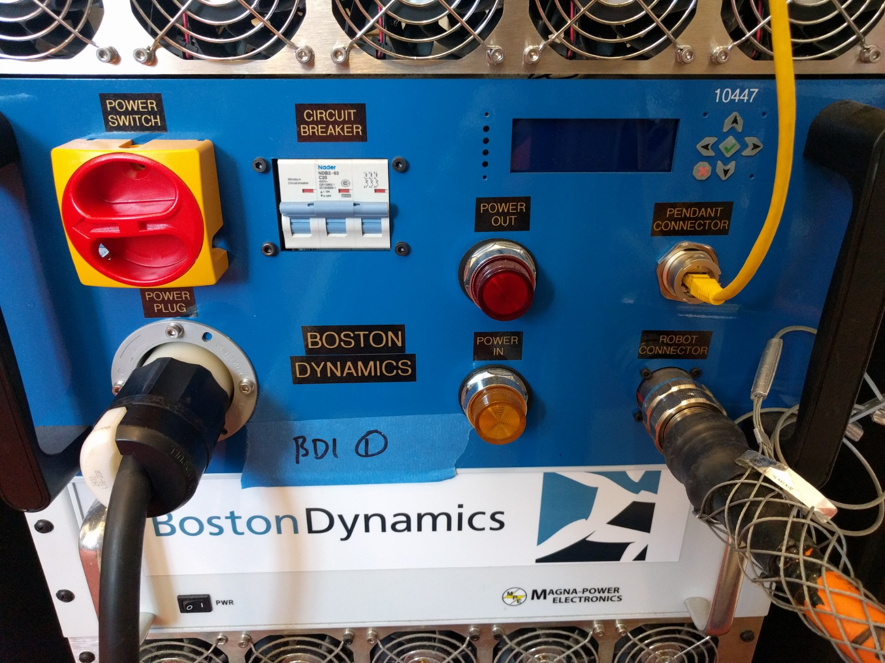
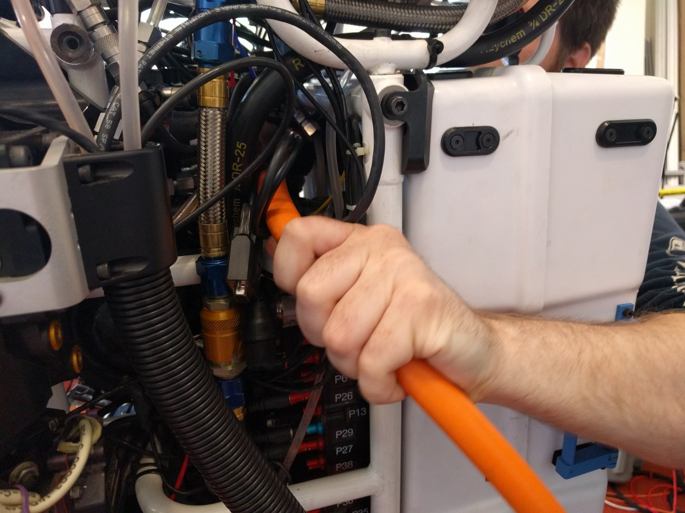
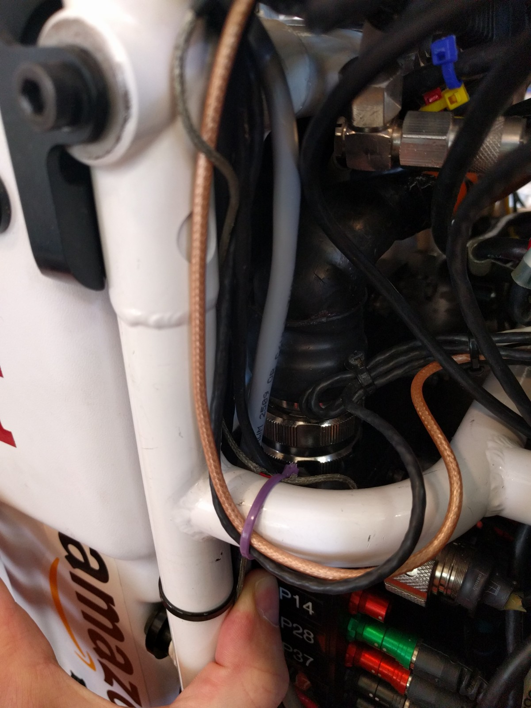
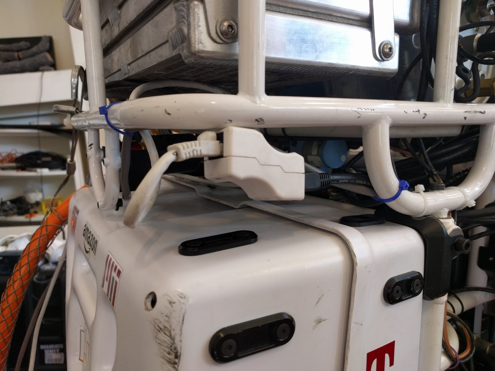
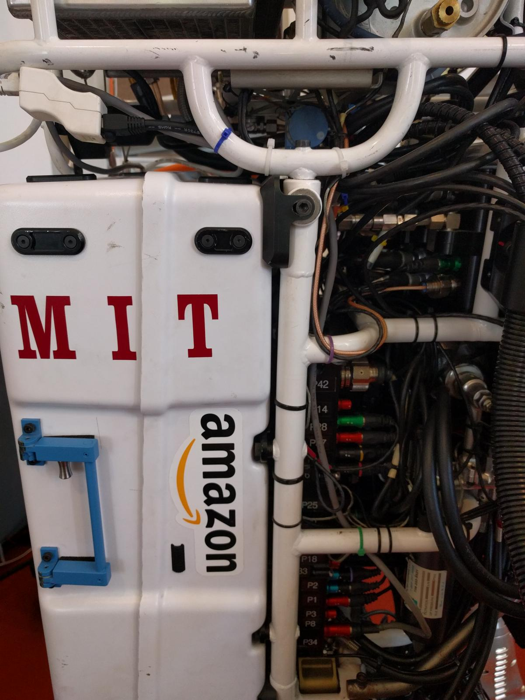
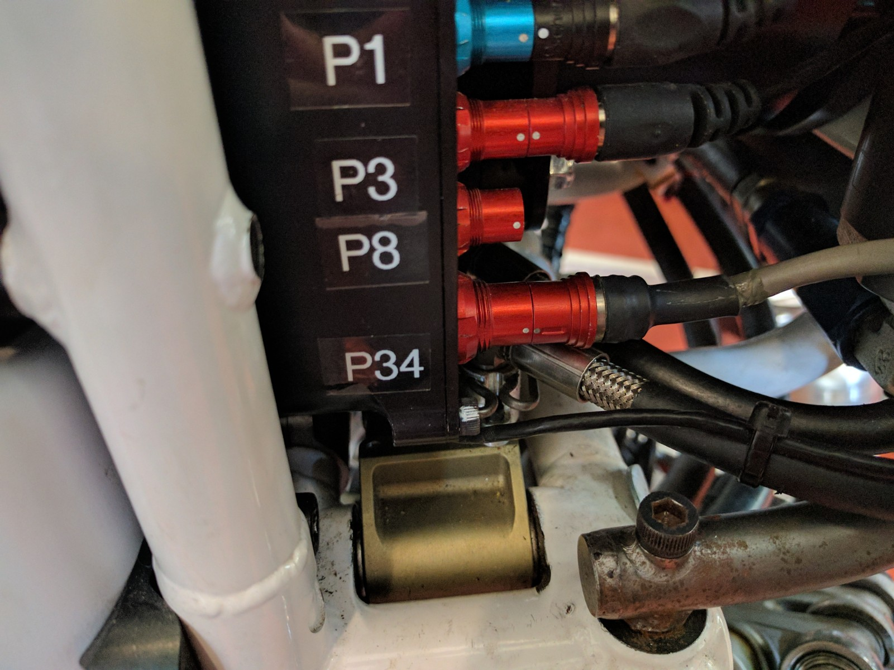

# Preconditions
This guide assumes that all cables are already plugged into the Ebox and that the shore power cable is connected to the 48V power supply. Both the Ebox and the 48V power supply should be turned off.

# Steps

## Plugging in the main power cable

Run the orange main power cable from the left side of the robot to the right side, as shown below.

After routing the cable, plug in the connector and twist it into place. Doing so may require manipulating the cable a bit.

## Plugging in the ethernet cable

Route the white ethernet cable from the left side of the robot to the right side, above the backpack, and plug it into the female-to-female ethernet connector. Zip tie the white cable to the frame of the robot.

## Plugging in the shore power line

Route the shore power cable (grey cable with red connector) from the top left of the backpack to the connector labeled 'P34' on the right side of the robot. Zip tie as necessary.

Plug the cable into the 'P34' connector.

Now you can turn on the 48V power supply.
